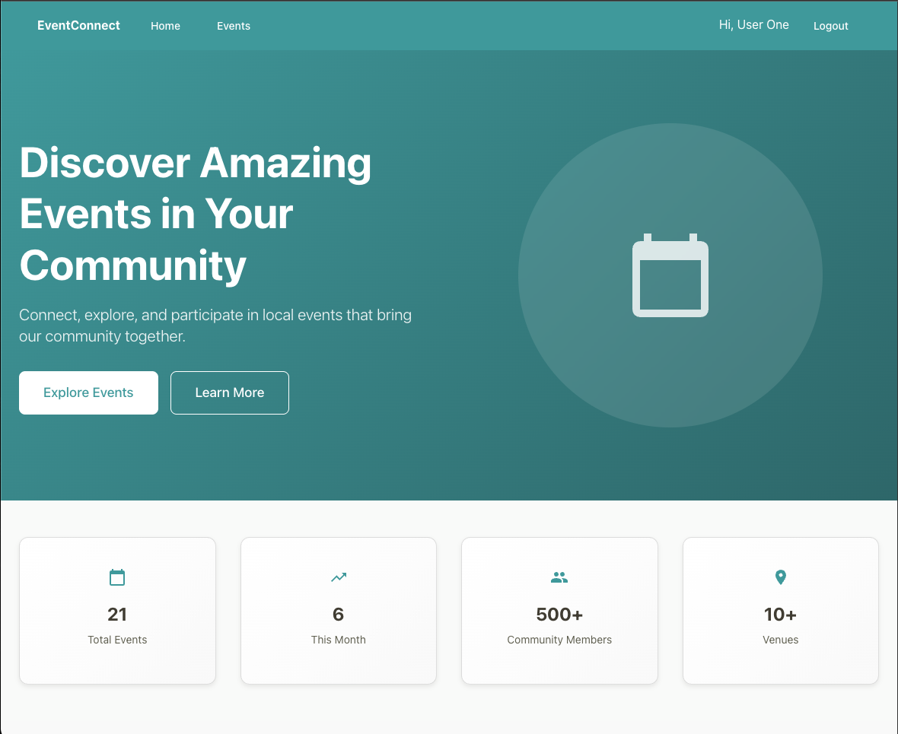
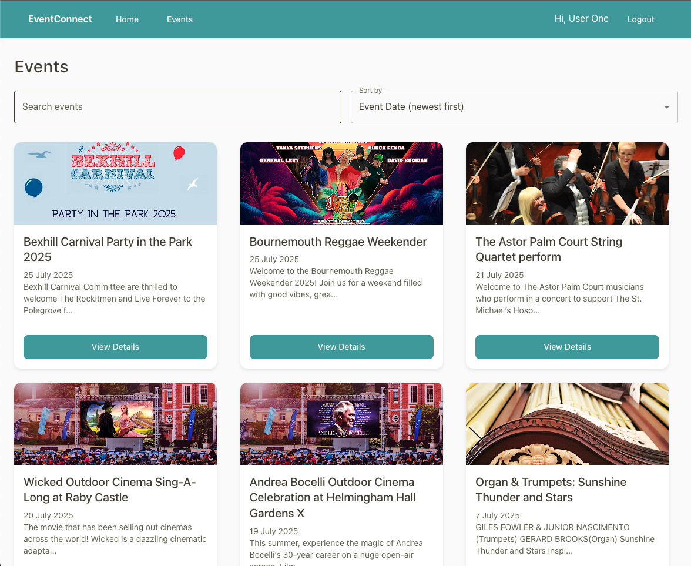
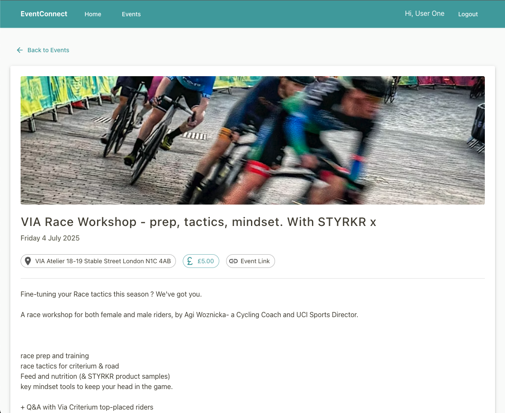

# EventConnect


## 🚀 A Modern Event Management Platform

EventConnect is a sleek, intuitive platform that connects communities through events. Built with React, TypeScript, and Firebase, it allows users to discover local events, register with ease, and sync directly with their personal calendars.

## 🌐 Live Demo

**[🔗 View Live Demo](https://eventconnectapp.netlify.app)**

## 📸 Screenshots

### Home Page



### Event Discovery



### Event Details



## ✨ Key Features

- 🔍 **Event Discovery**: Browse through a curated list of community events
- 📝 **Seamless Registration**: Sign up for events with a single click
- 📅 **Calendar Integration**: Add events directly to Google Calendar
- 👤 **User Accounts**: Track your registered events and preferences
- 🛡️ **Admin Dashboard**: For organizers to create and manage events
- 📱 **Responsive Design**: Perfect experience on any device
- 🎨 **Modern UI**: Clean, intuitive interface built with Material-UI

## 🛠️ Tech Stack

- **Frontend**: React 18, TypeScript, Vite
- **UI Framework**: Material UI
- **State Management**: React Context API
- **Backend & Auth**: Firebase (Authentication, Firestore)
- **Calendar Integration**: Google Calendar API
- **Deployment**: Netlify

## 🔌 Integrations

- **Google Calendar API**: Seamless calendar synchronization
- **Firebase Authentication**: Secure user management
- **Firestore Database**: Real-time data storage
- **Netlify Hosting**: Fast, reliable deployment

## 🔧 Installation & Setup

### Prerequisites

- Node.js (v16 or later)
- npm or yarn
- Firebase account

### Getting Started

1. **Clone the repository**

git clone https://github.com/alexizumi/event-connect.git
cd event-connect

2. **Install dependencies**

```bash
npm install
```

### or

```bash
yarn install
```

3. **Set up environment variables**

Create a '.env.local' file in the root directory with the following variables:
VITE_FIREBASE_API_KEY=your-api-key
VITE_FIREBASE_AUTH_DOMAIN=your-project-id.firebaseapp.com
VITE_FIREBASE_PROJECT_ID=your-project-id
VITE_FIREBASE_STORAGE_BUCKET=your-project-id.appspot.com
VITE_FIREBASE_MESSAGING_SENDER_ID=your-messaging-sender-id
VITE_FIREBASE_APP_ID=your-app-id

You can obtain these values from your Firebase project settings.

4. **Start the development server**

```bash
npm run dev
```

### or

```bash
yarn dev
```

5. **Open your browser**

Navigate to http://localhost:5173 to see the application running.

## 🧪 Testing the Application

Test User Accounts
For testing purposes, you can use these pre-configured accounts:

Regular User:

- Email: user.one@gmail.com
- Password: 1234567890

Admin User:

- Email: admin@gmail.com
- Password: 1234567890

## Key Workflows to Test

1. Browse Events: Navigate to the Events page to view all upcoming events
2. Create an Account: Click "Sign Up" to create your own account
3. Register for an Event: Click on any event, then "Register" to sign up
4. Add to Calendar: After registering, click "Add to Calendar" to sync with Google Calendar
5. Admin Features: Log in with the admin account to create and manage events

## 🚀 Deployment

The application is deployed on Netlify and can be accessed at [eventconnectapp.netlify.app](https://eventconnectapp.netlify.app).
To deploy your own instance:

1. **Build the application:**

```bash
npm run build
```

### or

```bash
yarn build
```

2. **Deploy to Netlify:**

- Connect your GitHub repository to Netlify
- Set the build command to npm run build or yarn build
- Set the publish directory to dist
- Add your environment variables in the Netlify dashboard

## 🔍 Project Structure

event-connect/
├── public/                 # Static assets
├── src/
│   ├── assets/            # Images, fonts, etc.
│   ├── components/        # Reusable UI components
│   ├── constants/         # Constant information
│   ├── context/           # React context providers
│   ├── hooks/             # Custom React hooks
│   ├── pages/             # Page components
│   ├── services/          # API and Firebase services
│   ├── styles/            # Global styles and themes
│   ├── utils/             # Utility functions
│   ├── App.tsx            # Main application component
│   └── main.tsx           # Entry point
├── .env.example           # Example environment variables
├── .gitignore             # Git ignore file
├── index.html             # HTML template
├── package.json           # Dependencies and scripts
├── tsconfig.json          # TypeScript configuration
└── vite.config.ts         # Vite configuration

## 🔧 Troubleshooting

### Common Issues

**Google Calendar Integration Warning**

- The app shows a "not verified" warning because it's not officially verified by Google
- This is normal for development/demo apps
- Click "Advanced" → "Go to eventconnectapp.netlify.app" to continue

**Environment Variables**

- Make sure all Firebase environment variables are correctly set
- Check that your Firebase project has the correct domain configured

**Build Issues**

- Ensure you're using Node.js v16 or later
- Clear node_modules and reinstall if experiencing dependency issues

## 🤝 Contributing

Contributions are welcome! Please feel free to submit a Pull Request.

1. Fork the project
2. Create your feature branch (git checkout -b feature/AmazingFeature)
3. Commit your changes (git commit -m 'Add some AmazingFeature')
4. Push to the branch (git push origin feature/AmazingFeature)
5. Open a Pull Request

## 📝 About the Developer

Built with ❤️ by **Alexandre Izumi**

- 💼 [LinkedIn](https://www.linkedin.com/in/alexizumi/)
- 🐙 [GitHub](https://github.com/alexizumi)
- 📧 alexizumi@outlook.com

_EventConnect showcases modern React development with clean architecture, seamless integrations, and thoughtful UX design._

I'm a passionate full-stack developer with expertise in React, TypeScript, and cloud services. EventConnect showcases my ability to build intuitive, scalable applications that solve real-world problems.

I designed this platform to demonstrate:

- Clean, maintainable code architecture
- Modern React patterns and best practices
- Seamless integration with third-party services
- Thoughtful UX/UI design principles
- Secure authentication and data handling

## 📄 License

This project is licensed under the MIT License - see the LICENSE file for details.

EventConnect: Bringing communities together, one event at a time.
